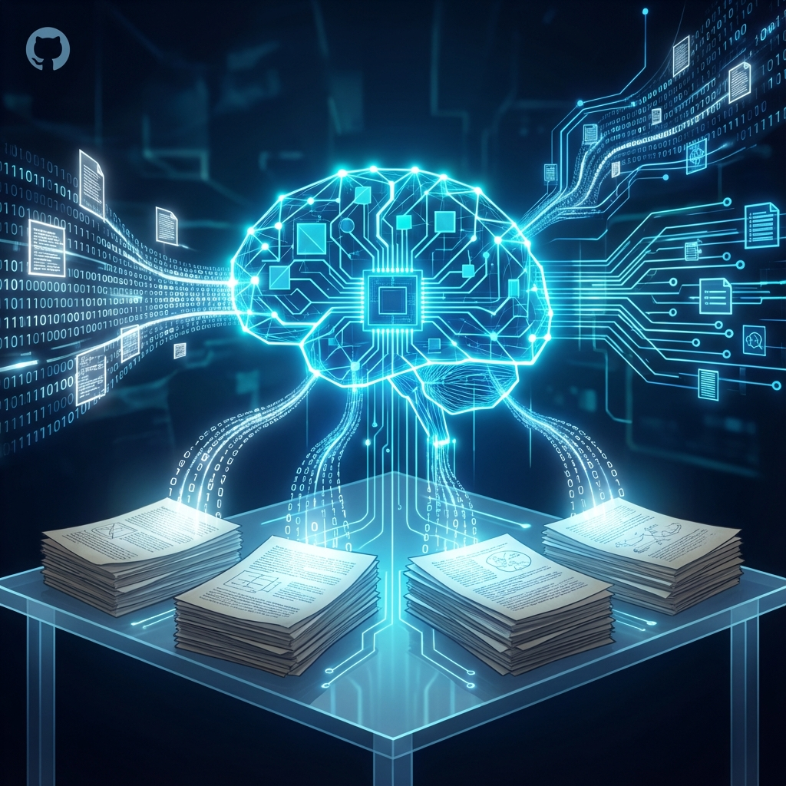

# DocuMind-Swarms: Cognitive Document Orchestrator



> [!IMPORTANT]
> **Neural Link Required**: To activate the visual dashboard, you must manually upload the local `src/hero.png` file to the `src/` directory in this repository.

## System Abstract

**DocuMind-Swarms** is a next-generation intelligent automation system built on **Microsoft Azure**. It fuses the perceptual capabilities of **Azure Document Intelligence** with the cognitive synthesis of **Multi-Agent Swarms**.

Unlike traditional linear pipelines, DocuMind employs a "Neural Node" architecture where specialized autonomous agents collaborate to ingest, understand, index, and audit complex enterprise documents in real-time.

## Neural Architecture

The system operates via a high-speed inter-agent protocol:

```mermaid
graph LR
    Input((Input Node)) -->|Injects Asset| Manager{Cortex Hub}
    
    subgraph "Perception Layer"
    Vision[Vision Node<br/>(Azure Doc Intel)]
    end
    
    subgraph "Memory Layer"
    Memory[Memory Node<br/>(Azure AI Search)]
    end
    
    subgraph "Cognition Layer"
    Logic[Logic Node<br/>(Strategic Analysis)]
    end
    
    Manager -->|Dispatch| Vision
    Vision -->|Raw Structure| Manager
    Manager -->|Dispatch| Memory
    Memory -->|Knowledge Graph| Manager
    Manager -->|Dispatch| Logic
    Logic -->|Compliance Audit| Input
    
    style Input fill:#222,stroke:#0ff,stroke-width:2px,color:#fff
    style Manager fill:#222,stroke:#f0f,stroke-width:2px,color:#fff
    style Vision fill:#222,stroke:#0f0,stroke-width:2px,color:#fff
    style Memory fill:#222,stroke:#00f,stroke-width:2px,color:#fff
    style Logic fill:#222,stroke:#ff0,stroke-width:2px,color:#fff
```

## Node Capabilities

*   **Vision Node**: Equipped with `azure-ai-documentintelligence`. It doesn't just read text; it understands layout, tables, and structural hierarchy.
*   **Memory Node**: The custodian of the `azure-search-documents` index. It ensures persistent knowledge retention (RAG readiness).
*   **Logic Node**: An advanced LLM persona designed to apply complex business rules to extracted data.

## Deployment Sequence

### Phase 1: Environment Uplink

1.  Clone the repository:
    ```bash
    git clone https://github.com/YOUR_USERNAME/documind-swarms.git
    cd documind-swarms
    ```

2.  Install neural dependencies:
    ```bash
    pip install -r requirements.txt
    ```

3.  Configure API Keys in `.env`:
    ```ini
    AZURE_DOC_INTEL_ENDPOINT=...
    AZURE_DOC_INTEL_KEY=...
    AZURE_SEARCH_ENDPOINT=...
    ```

### Phase 2: System Ignition

Initiate the swarm:

```bash
python main.py
```

## Innovation & Future Roadmap

*   **v2.0**: Integration with **Azure OpenAI Vision** for image-heavy documents.
*   **v3.0**: Autonomous self-healing swarms that correct OCR errors.
