# DocuMind-Swarms: Cognitive Document Orchestrator

## System Abstract

**DocuMind-Swarms** is a next-generation intelligent automation system built on **Microsoft Azure**. It fuses the perceptual capabilities of **Azure Document Intelligence** with the cognitive synthesis of **Multi-Agent Swarms**.

Unlike traditional linear pipelines, DocuMind employs a "Neural Node" architecture where specialized autonomous agents collaborate to ingest, understand, index, and audit complex enterprise documents in real-time.

## Neural Architecture

The system operates via a "Hub-and-Spoke" neural protocol:

```mermaid
graph TD
    %% Core Nodes
    Manager{{"Cortex Hub<br/>(Orchestrator)"}}
    Input(("Input Node<br/>(User Proxy)"))
    
    %% Semantic Clusters
    subgraph "Perception"
    Vision["👁️ Vision Node<br/>(Azure Doc Intel)"]
    end
    
    subgraph "Memory Bank"
    Memory[("💾 Memory Node<br/>(Azure AI Search)")]
    end
    
    subgraph "Reasoning Engine"
    Logic["🧠 Logic Node<br/>(Strategic Analysis)"]
    end
    
    %% Data Flow
    Input ==>|1. Injects Asset| Manager
    Manager ==>|2. Dispatch| Vision
    Vision -.->|3. Extraction| Manager
    Manager ==>|4. Indexing| Memory
    Memory -.->|5. Confirmation| Manager
    Manager ==>|6. Audit Request| Logic
    Logic -.->|7. Compliance Report| Input
    
    %% Styling
    classDef hub fill:#bfb,stroke:#333,stroke-width:2px,color:#000;
    classDef nodes fill:#f9f,stroke:#333,stroke-width:2px,color:#000;
    classDef storage fill:#ff9,stroke:#333,stroke-width:2px,color:#000;
    
    class Manager hub;
    class Vision,Logic,Input nodes;
    class Memory storage;
```



## Tech Stack


## Node Capabilities

*   **Vision Node**: Equipped with `azure-ai-documentintelligence`. It doesn't just read text; it understands layout, tables, and structural hierarchy.
*   **Memory Node**: The custodian of the `azure-search-documents` index. It ensures persistent knowledge retention (RAG readiness).
*   **Logic Node**: An advanced LLM persona designed to apply complex business rules to extracted data.

## Deployment Sequence

### Phase 1: Environment Uplink

1.  Clone the repository:
    ```bash
    git clone https://github.com/YOUR_USERNAME/documind-swarms.git
    cd documind-swarms
    ```

2.  Install neural dependencies:
    ```bash
    pip install -r requirements.txt
    ```

3.  Configure API Keys in `.env`:
    ```ini
    AZURE_DOC_INTEL_ENDPOINT=...
    AZURE_DOC_INTEL_KEY=...
    AZURE_SEARCH_ENDPOINT=...
    ```

### Phase 2: System Ignition

Initiate the swarm:

```bash
python main.py
```

## Innovation & Future Roadmap

*   **v2.0**: Integration with **Azure OpenAI Vision** for image-heavy documents.
*   **v3.0**: Autonomous self-healing swarms that correct OCR errors.
